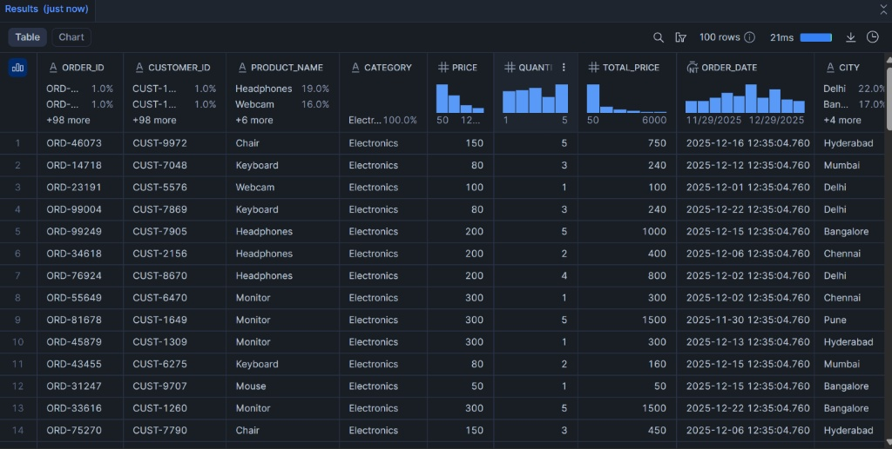
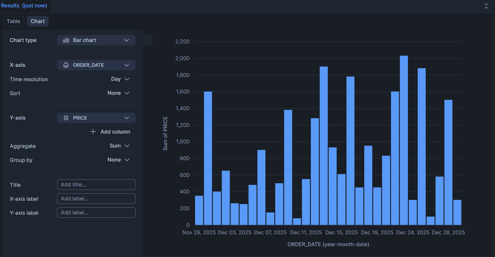

# 🛒 Enterprise E-Commerce Data Pipeline

## 🚀 Overview
A production-grade ELT (Extract, Load, Transform) pipeline designed to ingest high-volume synthetic E-commerce data into Snowflake. This project demonstrates how to decouple storage and compute using modern cloud data warehousing practices.
|  |  |
## 🛠️ Tech Stack
* **Language:** Python 3.9
* **Containerization:** Docker & Docker Compose
* **Orchestration:** Apache Airflow
* **Data Warehouse:** Snowflake (Standard Edition)
* **Transformation:** SQL (Snowflake Dialect)

## 🏗️ Architecture
1. **Extraction:** Python scripts generate/fetch synthetic transaction logs.
2. **Staging:** Data is pushed to an internal stage using Dockerized workers.
3. **Loading:** Airflow triggers `COPY INTO` commands to bulk load data into Snowflake.
4. **Transformation:** SQL scripts aggregate revenue metrics and customer LTV.

## 🔧 Key Features
* **Dockerized Environment:** Ensures consistency across dev/prod (No "it works on my machine" issues).
* **Fault Tolerance:** Implemented retry logic for database connection failures.
* **Security:** All credentials managed via Environment Variables.
